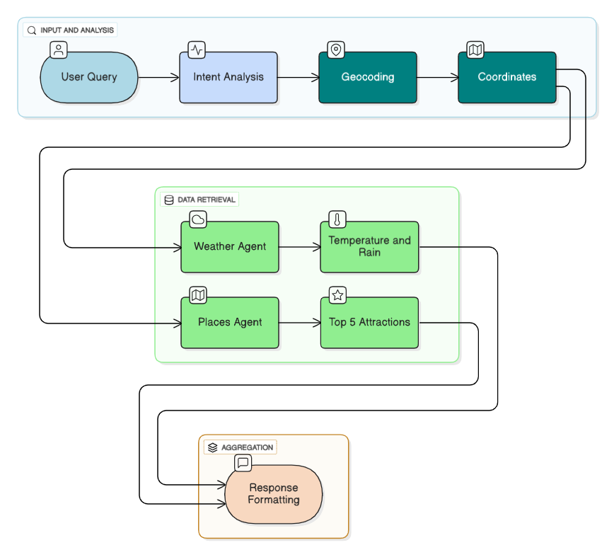

# 🌍 Multi-Agent Tourism Assistant

**An intelligent tourism planning system powered by a multi-agent architecture**

*Get real-time weather information and personalized tourist attraction recommendations for any destination worldwide.*

[Features](#-features) • [Demo](#-demo) • [Installation](#-installation) • [Usage](#-usage) • [Architecture](#-architecture) • [Contributing](#-contributing)

---

## 📖 Table of Contents

- [About](#-about)
- [Features](#-features)
- [Demo](#-demo)
- [Architecture](#-architecture)
- [Installation](#-installation)
- [Usage](#-usage)
- [API Reference](#-api-reference)
- [How It Works](#-how-it-works)
- [Project Structure](#-project-structure)
- [Contributing](#-contributing)
- [Future Enhancements](#-future-enhancements)
- [License](#-license)
- [Acknowledgments](#-acknowledgments)
- [Contact](#-contact)

---

## 🎯 About

The **Multi-Agent Tourism Assistant** is an intelligent system that helps travelers plan their trips by providing:
- Real-time weather conditions
- Curated tourist attraction recommendations
- Smart location-based suggestions

Built using a **multi-agent architecture**, the system coordinates specialized agents to fetch and process information from multiple free APIs, providing a seamless experience without requiring any API keys or authentication.

### Data Retrieval Workflow

  

---

## ✨ Features

### Core Capabilities
- 🤖 **Multi-Agent Architecture** - Parent orchestrator coordinating specialized child agents
- 🌤️ **Real-Time Weather Data** - Current temperature, conditions, and precipitation forecasts
- 🗺️ **Smart Recommendations** - Up to 5 curated tourist attractions per location
- 🔍 **Intelligent Intent Recognition** - Natural language understanding using rule-based NLP
- 🌐 **Global Coverage** - Works for any location worldwide
- ❌ **Robust Error Handling** - Graceful handling of non-existent or invalid locations
- 🆓 **100% Free** - No paid API keys required
- ⚡ **Fast & Lightweight** - Minimal dependencies, maximum performance

### Query Types Supported
| Query Type | Example |
|-----------|---------|
| **Weather Only** | "What's the weather in Barcelona?" |
| **Places Only** | "I'm going to Rome, let's plan my trip" |
| **Combined** | "What's the temperature in Dubai and what can I visit?" |

---

## 🎬 Demo

### Example Interaction 1: Trip Planning
👤 You: I'm going to Pune, let's plan my trip   

🤖 Processing your request...

🔍 Looking up location: Pune...
🗺️  Finding tourist attractions...

✨ Tourism Agent:
Here are some great places you can visit in Pune:
  1. National War Memorial Southern Command (Memorial)
  2. Parvati Museum (Museum)
  3. Parvati (Viewpoint)
  4. Bajirao I statue (Artwork)
  5. Maharshi Dhondo Keshav Karve (Artwork)
---
### Example Interaction 2: Weather Check
👤 You: What's the temperature in Bengaluru?

🤖 Processing your request...

🔍 Looking up location: Bengaluru...

🌤️  Fetching weather data...

✨ Tourism Agent:

In Bengaluru, it's currently 20.6°C with overcast and a 68% chance of rain.

---
### Example Interaction 3: Complete Planning
👤 You: I'm going to Mumbai, what's the weather and what can I visit??

🤖 Processing your request...

🔍 Looking up location: Mumbai...

🌤️  Fetching weather data...

🗺️  Finding tourist attractions...

✨ Tourism Agent:

In Mumbai, it's currently 26.3°C with mainly clear and a 0% chance of rain.

Here are some great places you can visit in Mumbai:
  1. Amphitheatre (Attraction)
  2. Bandra Fort (Ruins)
  3. Dr Babasaheb Ambedkar (Artwork)
  4. Lal Bahadur Shastri (Memorial)
  5. Castella de Aguada (Attraction)
---
### Example Interaction 4: Error Handling
👤 You: i want to visit nullcity 

🤖 Processing your request... 

🔍 Looking up location: nullcity... 

✨ Tourism Agent: 

I'm sorry, I don't know where 'nullcity' is. It doesn't seem to exist in my database. Could you please check the spelling or try a different place?
